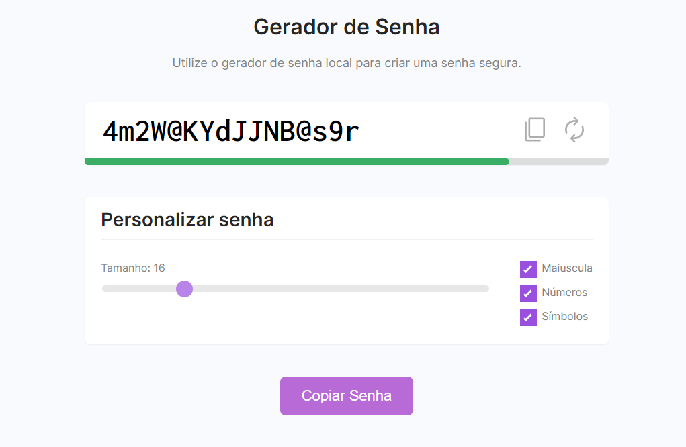

<h1 align="center">
    
    <br>
    Gerador de senha automático
</h1>

## :information_source: Sobre

Projeto criado na comunidade dev samurai para exercitar os conhecimentos em lógica de programação, javascript, html e css.
Nesse projeto é implementado um gerador de senha automático que possui um indicador se a senha é forte, média ou fraca dependendo no tamanho, se tem maiúsculas, números e símbolos.

## :computer: Demo

Imagem do gerador de senha criado.



```bash
# Clonar esse projeto
$ git clone https://github.com/portugaAndre/Gerador-de-Senha-Automatico.git Gerador de Senha
```

## :memo: Licença

Esse projeto está sobre a MIT license. Está totalmente dísponivel para ser utilizado!

---

Made with ♥ by Portuga :wave: [Entre em Contato!](https://www.linkedin.com/in/andre-vinicius-andrade/)
